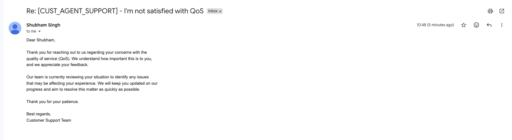
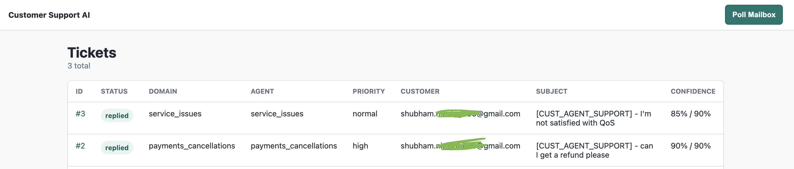
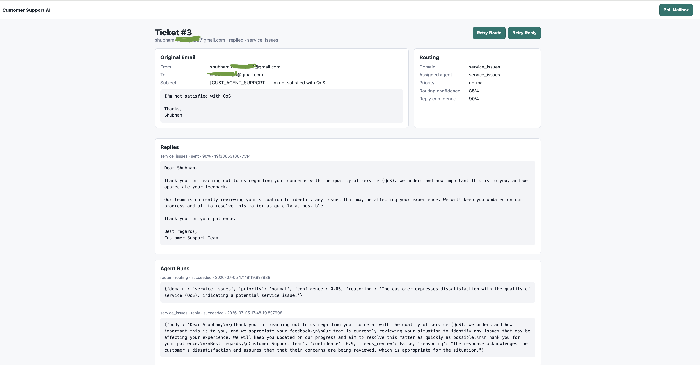
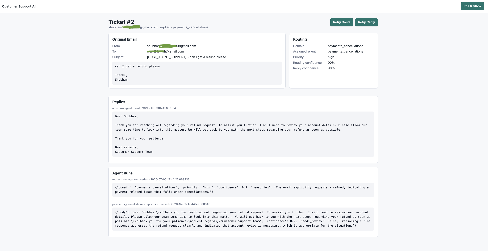
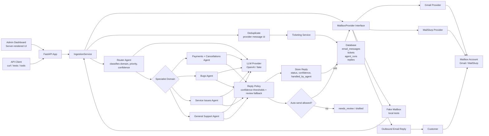

# Customer Support AI

A learning project for a multi-agent customer support system.

The app ingests customer emails, creates tickets, routes each ticket to a specialist support agent, generates a reply, and sends the reply when confidence thresholds are met.

## Demo

These screenshots capture a real end-to-end Gmail demo from July 5, 2026.

The demo shows:

- Gmail received an automated support reply from the system.
- The admin dashboard created tickets from customer emails.
- Tickets were routed to specialist domains such as `payments_cancellations` and `service_issues`.
- The UI shows assigned agent, priority, routing confidence, reply confidence, generated replies, and agent run traces.

### Gmail Reply

The customer receives a generated response from the support system.



### Ticket Dashboard

The dashboard lists processed tickets with status, domain, assigned agent, priority, customer, subject, and confidence.



### Service Issue Ticket Detail

Ticket detail view showing the original email, routing result, reply, and agent run trace for a service quality issue.



### Payment And Cancellation Ticket Detail

Ticket detail view showing a refund request routed to the payments and cancellations specialist.



## Architecture

This project is a polling-based multi-agent customer support system. It reads customer email, creates a ticket, routes the issue to the right specialist agent, drafts a reply, and sends the response when confidence checks pass.



### Runtime Flow

1. A customer sends an email with a subject such as `[CUST_AGENT_SUPPORT] - can I get a refund please`.
2. An admin or test client triggers mailbox polling.
3. The mailbox provider fetches at most one matching unread email.
4. The ingestion service stores the raw email and creates a ticket.
5. The router agent chooses a domain, priority, and confidence score.
6. The selected specialist agent drafts a response.
7. The system stores the reply with the agent that handled it.
8. If confidence thresholds pass and auto-send is enabled, the provider sends the reply.
9. The dashboard shows ticket status, routing, assigned agent, reply status, and agent run traces.

### Main Components

- `app/mailbox/*`: provider adapters for Gmail, MailSlurp, and fake local mailboxes.
- `app/services/ingestion.py`: orchestration for polling, routing, drafting, sending, and retrying.
- `app/services/ticketing.py`: email persistence and ticket creation.
- `app/agents/*`: router and specialist support agents.
- `app/models.py`: database schema for emails, tickets, agent runs, and replies.
- `app/templates/*`: admin dashboard views.

## Stack

- Python FastAPI
- SQLAlchemy
- Postgres in production-style setups, SQLite by default for local development
- MailSlurp mailbox adapter
- OpenAI-compatible LLM adapter
- Server-rendered admin dashboard

## Quickstart

```bash
python -m venv .venv
source .venv/bin/activate
pip install -e ".[dev]"
cp .env.example .env
uvicorn app.main:app --reload
```

Open:

- Admin dashboard: http://127.0.0.1:8000
- API docs: http://127.0.0.1:8000/docs

The default `.env.example` uses fake mailbox and fake LLM providers so the app can run without API keys.

## Using MailSlurp and OpenAI

Set these values in `.env`:

```bash
MAILBOX_PROVIDER=mailslurp
MAILSLURP_API_KEY=...
MAILSLURP_INBOX_ID=...

LLM_PROVIDER=openai
OPENAI_API_KEY=...
OPENAI_MODEL=gpt-4o-mini
```

Then run:

```bash
uvicorn app.main:app --reload
```

## Using Gmail and OpenAI

Gmail is the best zero-cost path for a real end-to-end test. Put your Google OAuth desktop-client file at `credentials.json`, then set:

```bash
MAILBOX_PROVIDER=gmail
GMAIL_CREDENTIALS_FILE=credentials.json
GMAIL_TOKEN_FILE=token.json
GMAIL_QUERY=in:inbox is:unread -from:me subject:"[CUST_AGENT_SUPPORT]"
GMAIL_MAX_RESULTS=1
GMAIL_SUBJECT_PREFIX=[CUST_AGENT_SUPPORT]
GMAIL_AUTH_BROWSER=chrome

LLM_PROVIDER=openai
OPENAI_API_KEY=...
AUTO_SEND_ENABLED=true
```

On the first poll, Google will open a browser consent flow. After you approve access, the app writes `token.json` locally and reuses it for later runs. Both `credentials.json` and `token.json` are ignored by Git.

The Gmail provider reads one unread inbox message whose subject starts with `[CUST_AGENT_SUPPORT]`, creates a ticket, sends a reply through Gmail, and marks the processed message as read.

Trigger polling manually:

```bash
curl -X POST http://127.0.0.1:8000/ingest/poll
```

## Troubleshooting Send Failures

MailSlurp trial accounts can receive external emails but may block external outbound sending. If that happens, the app marks the ticket/reply as `send_blocked` and stores the MailSlurp response body in `replies[].error`.

To test real inbound email plus LLM routing/drafting without attempting outbound sends, set:

```bash
AUTO_SEND_ENABLED=false
```

If a ticket shows `send_failed`, open the ticket detail page or call:

```bash
curl http://127.0.0.1:8000/tickets/{ticket_id}
```

The `replies[].error` field contains the MailSlurp status code, request URL, and response body.

To retry sending a reply for an existing failed ticket:

```bash
curl -X POST http://127.0.0.1:8000/tickets/{ticket_id}/reply/retry
```

The app also logs poll, routing, drafting, and send failures to the Uvicorn console.

## Current Scope

This is a v1 implementation:

- Polling-based email ingestion
- MailSlurp provider adapter
- Fake provider for local demos/tests
- LLM router and specialist agents
- Auto-send with confidence fallback to `needs_review`
- Minimal admin UI
