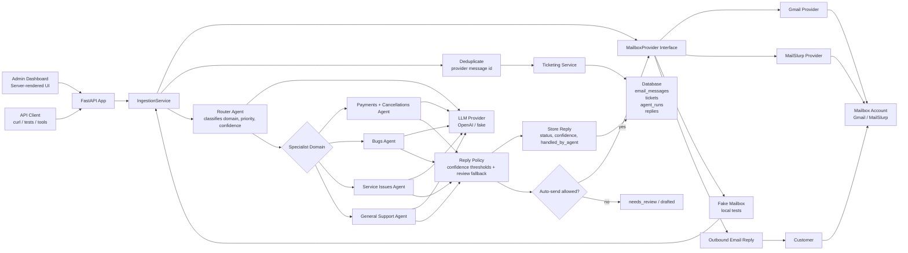

# Architecture

This project is a polling-based multi-agent customer support system. It reads customer email, creates a ticket, routes the issue to the right specialist agent, drafts a reply, and sends the response when confidence checks pass.

## System Diagram

## Runtime Flow

1. A customer sends an email with a subject such as `[CUST_AGENT_SUPPORT] - can I get a refund please`.
2. An admin or test client triggers mailbox polling.
3. The mailbox provider fetches at most one matching unread email.
4. The ingestion service stores the raw email and creates a ticket.
5. The router agent chooses a domain, priority, and confidence score.
6. The selected specialist agent drafts a response.
7. The system stores the reply with the agent that handled it.
8. If confidence thresholds pass and auto-send is enabled, the provider sends the reply.
9. The dashboard shows ticket status, routing, assigned agent, reply status, and agent run traces.

## Main Components

- `app/mailbox/*`: provider adapters for Gmail, MailSlurp, and fake local mailboxes.
- `app/services/ingestion.py`: orchestration for polling, routing, drafting, sending, and retrying.
- `app/services/ticketing.py`: email persistence and ticket creation.
- `app/agents/*`: router and specialist support agents.
- `app/models.py`: database schema for emails, tickets, agent runs, and replies.
- `app/templates/*`: admin dashboard views.
